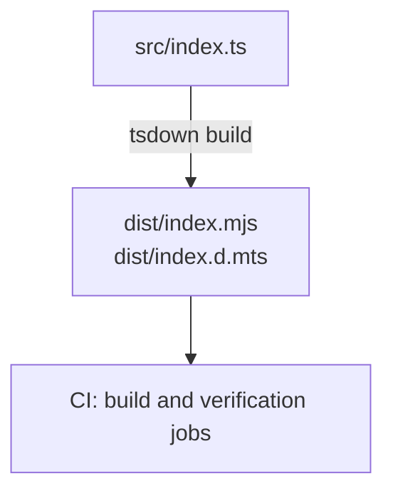

# YARAPA Code Standard: Architecture

System structure, composition order, module boundaries, and the distribution pipeline of `@yarapa/eslint-config-yarapa`.

---

## 1. Repository Topology

A pnpm workspace orchestrated by Turborepo, publishing three packages.

```text
.
├── .changeset/                     # Release intent and semver bump records
├── .claude/rules/                  # Repository invariants, scoped by path glob
├── .github/workflows/              # Verify, PR triage, CodeQL, preview, and release workflows
├── .husky/                         # commit-msg, pre-commit, and pre-push enforcement
├── docs/                           # This documentation set
├── eslint.config.ts                # Root linter; consumes the built package
├── packages/eslint-config-yarapa/  # The ESLint Flat Config package
│   ├── src/
│   │   ├── configs/                # Capability slices (see section 3)
│   │   │   ├── constants/          # Shared file globs — the only shared module
│   │   │   ├── yarapa/             # The composer slice
│   │   │   └── <capability>/       # One directory per capability
│   │   └── index.ts                # Sole public entrypoint
│   ├── test/                       # Five in-repo verification surfaces (see section 5)
│   ├── fixtures/                   # Declarative TypeScript projects
│   ├── dist/                       # Generated. Never edited.
│   └── tsdown.config.ts            # Build declaration
├── packages/prettier-config-yarapa/# The Prettier configuration package
│   ├── src/
│   │   ├── config.ts               # Prettier options definition
│   │   └── index.ts                # Sole public entrypoint
│   ├── dist/                       # Generated. Never edited.
│   └── tsdown.config.ts            # Build declaration
├── packages/commitlint-config-yarapa/# The Commitlint configuration package
│   ├── src/
│   │   └── index.ts                # Sole public entrypoint
│   ├── test/                       # Behavior tests
│   ├── dist/                       # Generated. Never edited.
│   └── tsdown.config.ts            # Build declaration
├── turbo.json                      # Task graph and cache inputs/outputs
└── pnpm-workspace.yaml
```

### Source of Truth Cascade

1. `src/` holds all behavior. Nothing else is authoritative.
2. `tsdown` generates `dist/` from `src/index.ts`. Files in `dist/` are never edited.
3. Root `eslint.config.ts` imports `dist/index.mjs`, so repository linting reflects the published surface. The `lint` and `lint:check` Turbo tasks declare `dependsOn: ["build"]` to keep that ordering guaranteed rather than assumed.

---

## 2. Composition and Evaluation Order

A **slice** is one capability's directory under `src/configs/`, owning its plugin, rules, and file globs. The composer spreads the slices in a fixed sequence.

Order is semantic, not cosmetic. ESLint merges matching config objects so later entries win, which makes the sequence load-bearing in three places:

- **`ignores` first.** Global exclusions must be registered before any rules execute.
- **`typescript` before `typeChecked`.** Parser and syntax rules establish the AST that type-aware rules then analyze.
- **`typescript` core replacements before `typeChecked` replacements.** The TypeScript slices switch off core rules they supersede, so the extension's version is the only one reporting.

The table below is the complete composition order: **every directory under `src/configs/` except `constants/` and `yarapa/` appears exactly once**, in the sequence the composer spreads them. Twenty-two slices expand to **37 config objects**, each carrying a `yarapa/...` name for traceability in `--print-config` output.

| Order | Slice             | Objects | Target globs                        | Role                                                                               |
| :---- | :---------------- | :------ | :---------------------------------- | :--------------------------------------------------------------------------------- |
| 1     | `ignores`         | 1       | —                                   | Globally excludes build output, dependency trees, and caches.                      |
| 2     | `base`            | 3       | JS + TS                             | Sets `linterOptions`, then core correctness and modern-JS rules.                   |
| 3     | `eslint-comments` | 1       | JS + TS                             | Governs directive comments and keeps suppressions scoped and reviewable.           |
| 4     | `promise`         | 1       | JS + TS                             | Unhandled rejections and broken async flows.                                       |
| 5     | `regexp`          | 1       | JS + TS                             | Pattern correctness, safety, and backtracking behavior.                            |
| 6     | `unused-imports`  | 1       | JS + TS                             | Dead-import removal with autofix.                                                  |
| 7     | `node`            | 1       | JS + TS                             | Node.js runtime correctness and module hygiene.                                    |
| 8     | `browser`         | 1       | JS + TS                             | Registers browser globals for universal and client code.                           |
| 9     | `typescript`      | 6       | TS, barrels, declarations, plain JS | Parser, core replacements, barrel, colocation, declaration, and plain-JS policies. |
| 10    | `type-checked`    | 1       | TS                                  | Type-aware analysis: unsafe operations, promises, boolean logic.                   |
| 11    | `import-x`        | 1       | JS + TS                             | Module resolution, cycles, and duplicate imports.                                  |
| 12    | `sonarjs`         | 1       | JS + TS                             | Cognitive complexity and code-smell detection.                                     |
| 13    | `jsdoc`           | 2       | JS and TS separately                | Tag validity and documentation formatting.                                         |
| 14    | `json`            | 3       | `*.json`, `*.json5`, `*.jsonc`      | Structure and sorting for data files; JSON5 relaxation is its own object.          |
| 15    | `package-json`    | 1       | `**/package.json`                   | Manifest fields, ordering, and export hygiene.                                     |
| 16    | `yaml`            | 1       | `**/*.{yaml,yml}`                   | Structure and syntax for YAML files.                                               |
| 17    | `toml`            | 1       | `**/*.toml`                         | Structure and syntax for TOML files.                                               |
| 18    | `formatters`      | 5       | HTML, CSS, SCSS, LESS               | Prettier-backed formatting for non-JS/TS assets across dedicated parsers.          |
| 19    | `stylistic`       | 1       | JS + TS                             | Owns JS/TS layout; `.prettierrc.json` mirrors it for other file types.             |
| 20    | `unicorn`         | 2       | JS + TS, plus React files           | Idiomatic modern patterns; React-specific overrides in a second object.            |
| 21    | `perfectionist`   | 1       | JS + TS                             | Alphabetical sorting of imports, keys, types, and interfaces.                      |
| 22    | `vitest`          | 1       | `**/*.{test,spec}.{ts,tsx,mts,cts}` | Assertion requirements and test hygiene.                                           |

Which plugin owns each capability is listed in the [package README](../packages/eslint-config-yarapa/README.md); the two tables answer different questions and are kept separate on purpose.

### Linter Options

The first `base` object reports stale disable directives:

```ts
linterOptions: {
  reportUnusedDisableDirectives: "error",
}
```

Inline ESLint suppressions remain available for justified exceptions. The `eslint-comments` slice requires descriptions, rejects broad or malformed directive usage, and `reportUnusedDisableDirectives` fails stale suppressions once they no longer hide a diagnostic.

---

## 3. Slice Anatomy

Every slice follows one skeleton, and no slice reaches into another's internals.

```text
<capability>/
├── <capability>.ts            # Required. Exports a named Linter.Config[]
├── index.ts                   # Required. Re-exports the slice as a folder-wrapped barrel.
├── <capability>.constant.ts   # Optional. Slice-local constants.
└── <capability>.type.ts       # Optional. Slice-local types.
```

Slices that need no local constants — `browser`, `regexp`, `perfectionist`, and others — ship only the pair. Slices that do keep them adjacent: `base`, `import-x`, `node`, `stylistic`, and `unicorn` carry a constants file. No slice currently needs local types, so no `.type.ts` file exists.

### Boundary Rules

- **`src/index.ts` is the only public entrypoint.** It exports the composed preset as `default` and nothing else.
- **No barrel re-exports a slice to the public surface.** The composer in `src/configs/yarapa/` imports each slice directly, so slices stay addressable only from inside the package.
- **`src/configs/constants/file-patterns.ts` is the only shared module.** Cross-cutting globs and extension lists are derived there once and consumed everywhere, so a new extension is a one-line change.
- **`yarapa/` is the composer, not a capability.** It imports every slice, spreads them into the preset order, and exports the result.

Because slices are private, a slice can be restructured or split without a major release. Only the composed array is a contract.

---

## 4. Distribution Pipeline

Packages are built with `tsdown` before CI verification.



[`packages/eslint-config-yarapa/package.json#files`](../packages/eslint-config-yarapa/package.json), [`packages/prettier-config-yarapa/package.json#files`](../packages/prettier-config-yarapa/package.json), and [`packages/commitlint-config-yarapa/package.json#files`](../packages/commitlint-config-yarapa/package.json) ship `dist` only.

---

## 5. Verification Surfaces

Distinct surfaces protect the package, and each owns a different contract.

| Surface                   | Location                  | Protects                                                                                               |
| :------------------------ | :------------------------ | :----------------------------------------------------------------------------------------------------- |
| **Behavior tests**        | `test/behavior/`          | Observable diagnostics — that a rule fires, with the right message and severity, on real fixture code. |
| **Configuration tests**   | `test/configuration/`     | Composition and ownership — that slices compose in order and each rule has one owner.                  |
| **Contract tests**        | `test/public-api/`        | The published export shape.                                                                            |
| **Type-resolution tests** | `test/config-validation/` | That type-aware rules resolve against the fixture projects rather than failing to load.                |
| **Autofix tests**         | `test/autofix/`           | That fixable rules rewrite source into the shape the rule requires.                                    |

Type-aware behavior is exercised against the declarative projects under [`fixtures/projects/`](../packages/eslint-config-yarapa/fixtures/projects), which include both a typed project with a real `tsconfig.json` and an untyped one. Test admission, ownership, and pruning policy is owned by [`.claude/rules/deterministic-testing.md`](../.claude/rules/deterministic-testing.md) rather than restated here.

---

## 6. TypeScript Version Roles and Ownership

TypeScript versions across the repository serve distinct, intentional roles and are not unified into a single version:

| Layer                      | Version / Range  | Location                                                                 | Purpose                                                                                                                    |
| :------------------------- | :--------------- | :----------------------------------------------------------------------- | :------------------------------------------------------------------------------------------------------------------------- |
| **Root Tooling**           | `7.0.2`          | `package.json#devDependencies.typescript`                                | Orchestrates repository-level type checking (`pnpm typecheck`) and compiles repository-level configs (`eslint.config.ts`). |
| **Package Compiler**       | `6.0.3`          | `packages/eslint-config-yarapa/package.json#devDependencies.typescript`  | Compiles `@yarapa/eslint-config-yarapa` via `tsdown` and validates internal package types (`tsc --noEmit`).                |
| **Consumer Peer Contract** | `>=5.0.0 <6.1.0` | `packages/eslint-config-yarapa/package.json#peerDependencies.typescript` | The contract bounding supported TypeScript versions in consuming applications.                                             |

Maintainers and automated agents must not normalize these versions to a single arbitrary value; each layer reflects a distinct architectural boundary.
